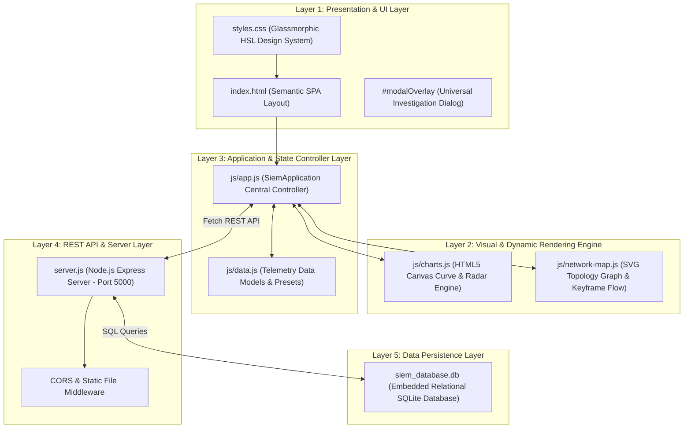
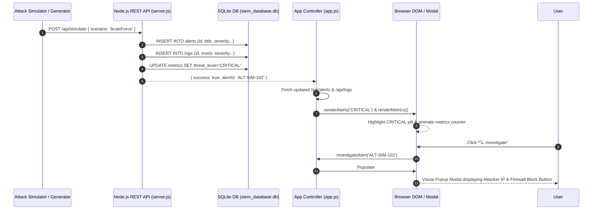

# 🎓 Student Guide: SIEM Log Dashboard Project

Welcome! This guide is written specifically for students to help you **understand every single part of this project**, excel in **viva/interview questions**, and confidently explain how your SIEM dashboard works from top to bottom.

---

## 💡 1. What is this Project in Simple Words?

Imagine a large building with security guards. Instead of watching 100 door sensors and security cameras manually, there is a **central control panel** that automatically rings a alarm when a door is broken or an unauthorized person enters.

In cybersecurity:
* **Computers, servers, and routers** generate thousands of text records called **Logs** every minute (e.g. *"User root failed password on port 22"*).
* A **SIEM** (Security Information and Event Management) is the digital control panel. It collects all those computer logs, filters out normal traffic, detects attack patterns (like password spraying), and alerts **SOC (Security Operations Center) analysts**.

This project is a **Full-Stack SIEM Dashboard** that collects, filters, visualizes, and triages security logs in real time.

---

---

## 🏗️ 2. Comprehensive System Architecture & Technical Design

### 🏛️ A. Layered Architecture Stack

The SIEM Log Dashboard is built using a decoupled **5-Layer Architecture**:



---

### 🔄 B. Telemetry & Triage Data Pipeline

Here is how data flows from ingestion to visualization when an attack occurs or a log is processed:



---

### 🗄️ C. Database Schema Architecture (SQLite Relational Model)

The SQLite database (`siem_database.db`) consists of **6 core tables**:

| Table Name | Primary Key | Key Columns | Purpose |
| :--- | :--- | :--- | :--- |
| **`profile`** | `id` | `name`, `initials`, `role`, `status` | Stores editable Analyst Portfolio Profile. |
| **`metrics`** | `id` | `total_events`, `active_alerts`, `threats_detected`, `critical_events`, `threat_level` | System health counters and current posture level. |
| **`logs`** | `id` | `timestamp`, `source_ip`, `dest_ip`, `username`, `event`, `severity`, `message`, `rule`, `mitre`, `payload` | Normalized security log stream with raw Syslog and JSON payloads. |
| **`alerts`** | `id` | `title`, `severity`, `rule_id`, `source_ip`, `dest_ip`, `attempts`, `timestamp`, `status`, `description` | Triage alert queue for SOC investigation. |
| **`rules`** | `id` | `title`, `author`, `severity`, `log_source`, `status`, `threshold`, `timeframe`, `mitre`, `condition`, `action`, `description` | SIGMA detection rules library. |
| **`incidents`** | `id` | `title`, `severity`, `status`, `target_host`, `attacker_ip`, `assigned_to`, `mitre_tags`, `playbook_actions` | High-level security incident campaigns and SOAR playbooks. |

---

---

## 📁 3. Detailed Breakdown of Every Project File

### 1. `server.js` (The Backend Server)
* **Language**: Node.js + Express.js + SQLite3.
* **What it does**:
  * Opens connection to SQLite database (`siem_database.db`).
  * Creates 6 database tables: `profile`, `metrics`, `logs`, `alerts`, `rules`, and `incidents`.
  * Seeds default security data if tables are empty.
  * Exposes **REST API endpoints** (`/api/alerts`, `/api/logs`, `/api/rules`, `/api/metrics`, `/api/profile`, `/api/simulate`).
  * Listens for requests on **Port 5000**.

### 2. `siem_database.db` (The Database)
* **Type**: Embedded Relational SQLite Database.
* **What it does**: Holds real persistent data for alerts, logs, rules, analyst profile name, and system metrics so data isn't lost when you refresh the browser.

### 3. `index.html` (The Web Structure)
* **What it does**: The Single Page Application (SPA) container. Contains all section views:
  * `#view-dashboard` ➔ Overview metrics, threat pulse, security curve chart, attack topology map, threat radar, incident timeline.
  * `#view-logs` ➔ Normalized log table with expandable syslog/JSON inspection.
  * `#view-alerts` ➔ Alert cards grid with severity filter pills.
  * `#view-rules` ➔ SIGMA rule library & custom rule generator.
  * `#view-incidents` ➔ Active threat campaigns & SOAR playbooks.
  * `#view-concepts` ➔ Educational guide explaining SIEM, MITRE, SIGMA, SOAR.
  * `#view-settings` ➔ Analyst profile customization & attack simulator controls.
  * `#modalOverlay` ➔ Universal popup window overlay for investigations.

### 4. `css/styles.css` (The Design System)
* **What it does**: Controls the visual design:
  * **HSL Dark Theme**: Deep navy background (`#060911`), electric blue (`#3b82f6`), cyan (`#06b6d4`), purple glow (`#a855f7`).
  * **Glassmorphic Cards**: Soft translucent backgrounds with subtle borders (`backdrop-filter: blur(12px)`).
  * **Severity Colors**:
    * 🟦 `INFO` ➔ Blue
    * 🟩 `LOW` ➔ Green
    * 🟨 `MEDIUM` ➔ Yellow
    * 🟧 `HIGH` ➔ Orange
    * 🟥 `CRITICAL` ➔ Red
  * **Modal Window Rules**: Fixed overlay positioning with high `z-index: 99999` so popup windows appear clearly over the screen.

### 5. `js/app.js` (The Main Application Controller)
* **What it does**: The central brain of the frontend JavaScript:
  * Binds `window.SIEM_APP` globally.
  * Checks REST API connection (`http://localhost:5000/api/metrics`).
  * Renders metrics counters, live feed, alert grids, log tables, SIGMA rule list.
  * Handles view switching when sidebar items are clicked.
  * Manages severity filtering (`ALL`, `CRITICAL`, `HIGH`, `MEDIUM`, `LOW`, `INFO`).
  * Triggers modal investigations (`investigateAlert(alertId)`).
  * Runs live simulation stream adding synthetic log events every 4.5 seconds.

### 6. `js/data.js` (The Data Models & Preset Scenarios)
* **What it does**: Holds initial JavaScript data structures, MITRE ATT&CK tags, preset attack scenarios (Brute Force, Ransomware, Recon Scan), and 5-Question SOC answers.

### 7. `js/charts.js` (HTML5 Canvas Visual Engine)
* **What it does**:
  * Draws the **Security Activity** smooth bezier curve graph (Events vs Alerts).
  * Animates the **Threat Activity Radar** canvas with a 360° rotating radar sweep line.

### 8. `js/network-map.js` (SVG Attack Topology Graph)
* **What it does**: Renders an interactive SVG node graph connecting Workstations, Firewalls, Threat Intel databases, and DB Servers with animated CSS data packets.

### 9. `package.json` (Dependencies Manifest)
* **What it does**: Defines project details and npm dependencies:
  * `express` (Web framework)
  * `cors` (Cross-Origin Resource Sharing)
  * `sqlite3` (Database driver)

---

## 🔍 4. Key Security Concepts to Master for Viva / Interviews

### Q1: What is a SIEM and why do companies use it?
> **Answer**: SIEM stands for **Security Information and Event Management**. It centralizes log collection across an enterprise, normalizes different log formats, correlates events to identify attacks, and alerts SOC analysts so threats can be mitigated quickly.

### Q2: What are the 5 Questions a SOC Analyst must answer during triage?
> **Answer**:
> 1. **What is happening?** (e.g. 45 failed SSH logins)
> 2. **Is there a threat?** (e.g. Yes, automated brute force attack)
> 3. **How serious is it?** (e.g. CRITICAL - targeting production database)
> 4. **Where did it come from?** (e.g. IP 192.168.1.50)
> 5. **What should be investigated/contained?** (e.g. Isolate IP on firewall and revoke user credentials)

### Q3: What is the MITRE ATT&CK Framework?
> **Answer**: A globally accessible matrix of tactics and techniques used by threat actors based on real-world observations. Examples used in this dashboard include `T1110 - Brute Force`, `T1548.003 - Sudo Caching`, and `T1041 - Exfiltration Over C2`.

### Q4: What is a SIGMA Rule?
> **Answer**: SIGMA is an open, standardized rule signature format (written in YAML) that describes detection logic independently of specific vendor platforms. Analysts can compile SIGMA rules for Splunk, Elastic, or custom SIEM engines.

### Q5: What is SOAR?
> **Answer**: SOAR stands for **Security Orchestration, Automation, and Response**. It enables automated containment actions (like blocking an IP or disabling an account) without waiting for manual human intervention.

---

## 🚀 5. How to Run and Demonstrate this Project (Step-by-Step)

1. **Start the Backend REST API Server**:
   Open terminal in project directory:
   ```bash
   node server.js
   ```
   *Output will show:* `Connected to SQLite database: siem_database.db`

2. **Start the Frontend Web Server**:
   Open a second terminal window:
   ```bash
   python -m http.server 8080
   ```

3. **Open Browser**:
   Go to: `http://localhost:8080/`
   Verify header badge: `🟢 EXPRESS & SQLITE BACKEND ACTIVE (PORT 5000)`

4. **Live Demo Walkthrough Steps for Evaluators**:
   * **Step A (Dashboard)**: Show Threat Pulse meter, Security Activity canvas curve, SVG Attack Topology map with animated packet flow, and radar sweep.
   * **Step B (Alert Management)**: Show filter buttons (`CRITICAL`, `HIGH`, `MEDIUM`, `LOW`, `INFO`, `ALL`). Click **🔍 Investigate** on any card to show the modal investigation window with firewall block action.
   * **Step C (Log Explorer)**: Click on any log row to expand the raw Syslog message and formatted JSON payload.
   * **Step D (Detection Rule Builder)**: Write a condition (e.g. `event == "SSH_FAIL"`), click **🧪 Test in Sandbox**, and click **🚀 Save & Deploy Rule to Engine** to demonstrate database saving.
   * **Step E (Attack Simulator)**: Click **⚡ Trigger Test Alert** in the top header to simulate a live password spray attack in real time!
